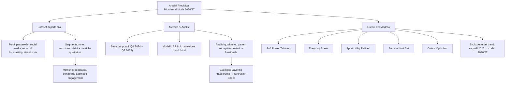

```mermaid
flowchart TD
    A["Analisi Predittiva Microtrend Moda 2026/27"]

    A --> B["Dataset di partenza"]
    B --> C["Fonti: passerelle, social media, report di forecasting, street style"]
    B --> D["Segmentazione: microtrend visivi + metriche qualitative"]
    D --> E["Metriche: popolarità, portabilità, aesthetic engagement"]

    A --> F["Metodo di Analisi"]
    F --> G["Serie temporali (Q4 2024 – Q3 2025)"]
    F --> H["Modello ARIMA: proiezione trend futuri"]
    F --> I["Analisi qualitativa: pattern recognition estetico-funzionale"]
    I --> J["Esempio: Layering trasparente → Everyday Sheer"]

    A --> K["Output del Modello"]
    K --> L["Soft Power Tailoring"]
    K --> M["Everyday Sheer"]
    K --> N["Sport Utility Refined"]
    K --> O["Summer Knit Set"]
    K --> P["Colour Optimism"]

    K --> Q["Evoluzione dei trend: segnali 2025 → codici 2026/27"]
```
